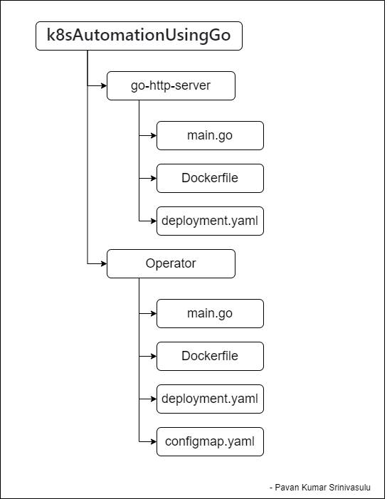
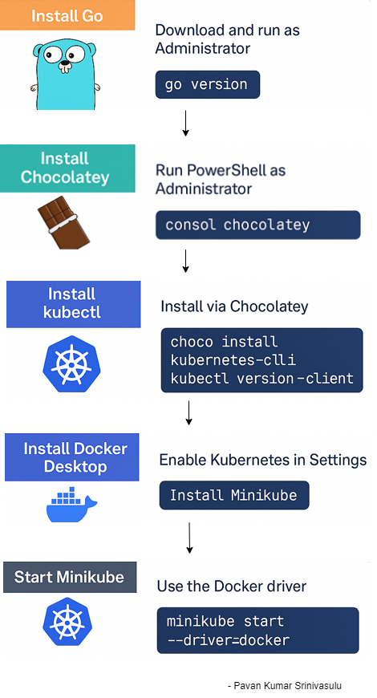

# Kubernetes Dynamic Environment Variable Operator using Go!

This project demonstrates how to create a custom Kubernetes Operator using Go that dynamically updates the environment variables of a running microservice by watching a ConfigMap.

## Project Directory Structure



## Pre requisites

This project is using a Windows Powershell.

Install Go - https://go.dev/dl/ , run as administrator

```bash
go version
```
Install chocolatey to install kubectl - https://chocolatey.org/install, make sure you run this command on power shell running powershell as administrator. 

To install kubectl - 

```bash
choco install kubernetes-cli
kubectl version --client
```

Install Docker desktop. Go to settings inside Docker desktop and allow kubernetes to run.

```bash
docker version
```

Install Minikube - https://minikube.sigs.k8s.io/docs/start/?arch=%2Fwindows%2Fx86-64%2Fstable%2F.exe+download

```bash
minikube version
minikube start --driver=docker
```


# Build and Deploy the Go HTTP Server in Kubernetes

Make sure you are inside go-http-server directory.

## Build Docker image:

Make sure Minikube uses your local Docker image:

```bash
minikube docker-env

& minikube -p minikube docker-env | Invoke-Expression  //Run this command to ensure you're inside Minikube's Docker context:

docker build -t go-http-env .
```
## Deploy to Kubernetes using configmap.yaml

```bash
kubectl apply -f deployment.yaml

kubectl get pods

minikube service go-http --url

```

Now try pasting the URL on to the browser, you must see set of predefined Environment Variable.

# Building a Kubernetes Operator in Go that:

Make sure you are inside operator directory.

## Initialise Go Module

```bash
go mod init operator
```

## Install Kubernetes go client

```bash
go get k8s.io/client-go@v0.26.3
go get k8s.io/apimachinery@v0.26.3
```
The above installation might take some time, give it some time.

```bash 
go mod tidy
```

This will create required dependencies (especially for client-go)

## Make sure it's the minikube docker

```bash
& minikube -p minikube docker-env | Invoke-Expression

docker build -t env-operator .

kubectl apply -f deployment.yaml
```

## Apply  configmap.yaml and rbac.yaml

```bash
 kubectl apply -f configmap.yaml
 
 kubectl apply -f rbac.yaml
```

## Check for pods status

```bash
kubectl get pods
```
## See the dynamic changes in configmap.yaml reflecting on the URL

```bash
minikube service go-http --url
```

Open the URL in browser and see the actual env variables.

You can also see it on the console using, 

```bash
kubectl exec -it deploy/go-http -- printenv
```

Now dynamically edit the config file, 

```bash
kubectl edit configmap environment //edit, save and quit
```

Now open the url in browser, each and every time you change/edit the variables in configmap, it changes dynamically on browser as well. 

